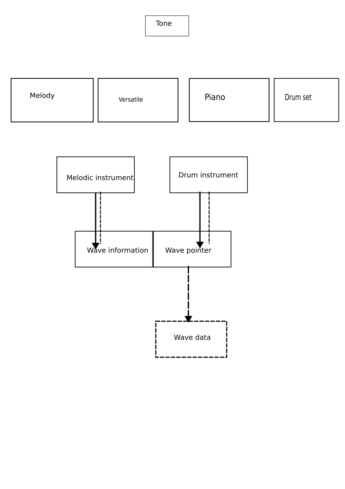

# AiX Synthesis
This document provides details of the AiX chip produced by Casio and used as a
sound synthesis source in Casio keyboards such as the CTX and CTS series. It's
been worked out by members of the Casio user community through black-box
analysis of the keyboards. _It is not a complete spec!_ If anything it is
just a random collection of observations, but should still be useful for anyone
wishing to understand more about how the chip produces sound.

The details given below are correct for the CTX3000 keyboard. Everything should
be identical on the CTX5000, while other keyboards (such as the CTX700) will be
similar but might differ, for example, in number of parameter sets.

## More Information

For details of how parameter sets are arranged in memory on the CTX3000, see:

[Sysex messages Instrument specific.txt](https://github.com/michgz/ac7maker/blob/master/Documentation%20of%20Casio%20formats/Sysex%20messages%20Instrument%20specific.txt)

For other details of the parameters set, especially Tones, see:

[Documentation of Casio formats](https://github.com/michgz/ac7maker/tree/master/Documentation%20of%20Casio%20formats)

Tools for editing Tone parameter sets:

[Tone Tyrant for Casio](https://github.com/michgz/tonetyrant)

[Tone Mutant](https://github.com/Barsik-Barbosik/Tone-Mutant)

## Overview

AiX is a wavetable synthesiser. There is a highly sophisticated arrangement with
multiple layers of data structures to translate incoming MIDI or keyboard signals
into playback of the recorded wave data.

Here is a diagram showing the overall system structure:

The main structures within this are:

* **Tone** (Category 3): this is the user-facing parameter set defining the
  tone sound. It defines effects such as DSP and portamento, adjustments to the
  underlying envelopes and filtering, and 1 or 2 pointers to low-layer wavetables.
  
  On CTX3000 there is space in user memory for 50 user-edited Tones to be stored.
  The Tones can be edited in the keyboard GUI, or externally to the keyboard using
  community-maintained tools such as Tone Tyrant or Tone Mutant and then loaded
  in using USB or USB-MIDI.  
  
  > [!NOTE]
  > Envelope and filter definitions in this
  > structure are *adjustments* to the low-layer definitions in the Instrument
  > structures. As such they don't have absolute meaning but are just relative to
  > the definitions in the Instruments.
  
* **Melody Wavetable** (Category 5): Most tones in the CTX keyboards use a Melody
  Wavetable. It is the simplest type of wavetable and is suitable for most
  melodic-sounding instrument types.

  Assigns Instruments (the next lower layer of structure) based on velocity
  and note. The space of all velocities and notes can be visualised as a 128x128
  square -- this wavetable allow dividing that space into rectagles and assigning
  each rectangle to a specific Instrument. See below for an example.
  
  Up to 8 rectagles can be defined.
  
  Rectangles can overlap, up to two - if more than 2 are defined for a particular
  velocity & note then only 2 will produce sound.
  
  Casio advertise AiX keyboards having "Maximum Polyphony 64 notes (32 for certain tones)".
  It's guessed that the "certain tones" with only 32 polyphony are the ones which
  have overlapping rectangles in their Melody Wavetables. Such tones fall into two types:
  
  * Stereo tones: in that case, the overlaps reference left-sounding and right-sounding
    Instruments.
    
  * Tones mixing two types of Instrument. There is only one example of that: it
    is "186 RIDE BASS", which combines a pitched sound (bass) with non-pitched
    sound (ride cymbal).
  

* **Versatile Wavetable** (Category 10): Similar to Melody Wavetable, assigns
  Instruments based on velocity and note, but allows more complexity in the
  assignment.
  
  Up to 24 rectangles can be defined.
  
  Up to 4 rectangles can overlap with all 4 producing sound. 4-way overlaps are
  not used for any tones in CTX keyboards; if they were, the maximum polyphony
  of such tones would presumably be 16.
  
* **Piano Wavetable** (Category 7): Allows even more complexity than Versatile in
  the assignment of Instruments. Each of the 128 notes is individually defined,
  with Instruments assigned to ranges of velocity.
  
  For each of the 128 notes, up to 16 velocity ranges can be defined. It's split
  across 2 halves of the structure (TBD: is this related to stereo? I.e. 8 velocity
  ranges for left-channel and 8 for right-channel?)

* **Drum Wavetable** (Category 6): Similar to Piano, it provides individual
  control of each of the 128 notes. Up to 16 velocity ranges can be specified
  per note, as well as other controls such as filtering and envelopes. Also,
  uniquely among the wavetables, the Instruments it points to are Drum Instruments
  rather than Melodic Instruments.

...

* **Wave Information & Wave Pointers** (Categories 14 & 15): there are two categories
  here, but the parameter sets are in 1-to-1 correspondence between the categories
  so they may as well be regarded as unified.
  
  Wave Information tells the system how to handle wave data, such as loop points.
  Wave Pointers contains only 2 values: pointer to start of the data, and the
  length of the data. Length is always an even number. It's believed (_TBC_!) that
  both values have units of bytes and that the data pointed to is 16-bits values
  (that is, the length in samples is half the length in bytes).

* **Wave Data**: recorded samples of sounds, stored in 16-bit PCM format. It is
  Casio's proprietary data and is not available for reading directly - even through
  JTAG.

## Tone

A Tone contains two slots for pointers to wavetables (Slot A and Slot B). Slot B
can be empty (which is indicated by pointing to Melody Wavetable #0). Unless Slot
B is empty, then Slot A and Slot B must be of the same type.

The following arrangements are used:

* Slot A used for Note-On, Slot B empty. This is the simplest case and is suitable for 
  most tones.
* Slot A used for Note-On, Slot B used for Note-Off. This is used in some harpsichord
  tones, to get a realistic sound of the plectrum returning to its rest position.
* Slot A used for solo note, Slot B used for subsequent (double-stop) notes. Used
  in some woodwind tones, to allow a solo instrument to sound piercing without
  chords sounding too harsh.
* Slot A & Slot B set to the same wavetable. It's not known what purpose this
  achieves. Most tones in the CTX use this pattern.
  
The types of wavetable supported are:

| Parameter values 1 & 21 | Type      |
| ----------------- | --------- |
| 0                 | Melody    |
| 6                 | Versatile |
| 4                 | Piano     |
| 2                 | Drum      |
  
## Melody

...

## Appendix A - Explanation of memory types

Parameter sets can be selected based on memory as well as category. The memory
types made available by Casio are:

| Memory type | Location | Used for |
| --- | --- | --- |
| 0   | Upgradeable ROM | Built-in data   |
| 1   | Non-volatile memory | User data   |
| 2   | Upgradeable ROM | Power-on settings   |
| 3   | RAM | Real-time settings   |
| 4   | Upgradeable ROM | Categories 14 & 15 only   |
